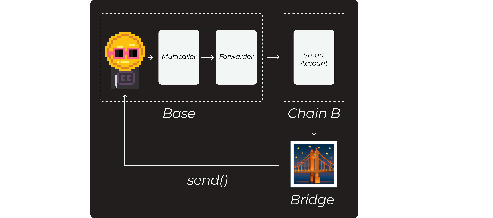

# Yerba: Cross-Chain Liquidity Aggregation Library

> ⚠️ This is a proof of concept done in hackathon, so there are some features that might work wrong.

Yerba is an experimental library for building multichain applications within the OP Stack. 

It aims to simplify cross-chain token aggregation, allowing users to pay on a specific chain by consolidating fragmented token balances from other chains.

---

## **How It Works**

1. **Multicaller Contract (Home Chain)**: Coordinates cross-chain balance aggregation by initiating calls to the forwarder.
2. **Forwarder Contract (Home Chain)**: Authorized by the user, it handles the execution of cross-chain sends to Smart Accounts on destination chains.
3. **Smart Account (Destination Chain)**: Manages token transfers and interacts with the bridge for burning and minting operations.
4. **Bridge**: Facilitates token transfers between chains, ensuring that tokens burned on the source chain are minted on the home chain.
5. **Send Function**: Consolidates aggregated tokens back to the user’s home chain account.
6. **User**: Initiates the payment on the home chain, while all cross-chain operations happen in the background.

---

## **Architecture Diagram**



## **Setup Instructions**

### **Prerequisites**
- Node.js (v16+)
- Foundry (for smart contract development)
- Docker (optional, for running Supersim)

### **Installation**
1. Clone the repository:
   ```bash
   git clone https://github.com/oxlumi/yerba.git
   cd yerba
   ```

2. Install dependencies:
   ```bash
   npm install
   ```

3. Build the contracts:
   ```bash
   forge build
   ```

4. (Optional) Run Supersim to simulate the multichain environment:
   ```bash
   supersim
   ```

### **Deploy Contracts**
Deploy the Multicaller and Forwarder contracts to the home chain:
```bash
forge script scripts/Deploy.s.sol:Deploy --rpc-url <HOME_CHAIN_RPC> --private-key <PRIVATE_KEY>
```

Deploy the Smart Accounts to the destination chains:
```bash
forge script scripts/DeploySmartAccounts.s.sol:Deploy --rpc-url <DEST_CHAIN_RPC> --private-key <PRIVATE_KEY>
```

---

## **Usage**

1. **Integrate the Library**
   Import Yerba’s contract library into your dApp to handle cross-chain token aggregation.

2. **Interact with the Contracts**
   Use the Multicaller to initiate cross-chain operations and the Forwarder to securely authorize transfers.

3. **Simulate Locally**
   Test the flow using Supersim to simulate multiple OP Stack chains in a local environment.

---

## **Contributing**

Contribute! Feel free to open issues or submit pull requests.

1. Fork the repository
2. Create a feature branch:
   ```bash
   git checkout -b feature/my-feature
   ```
3. Commit your changes:
   ```bash
   git commit -m "feat: ..."
   ```
4. Push to your branch:
   ```bash
   git push origin feature/my-feature
   ```
5. Open a pull request

## **License**

This project is licensed under the MIT License. See the LICENSE file for details.
